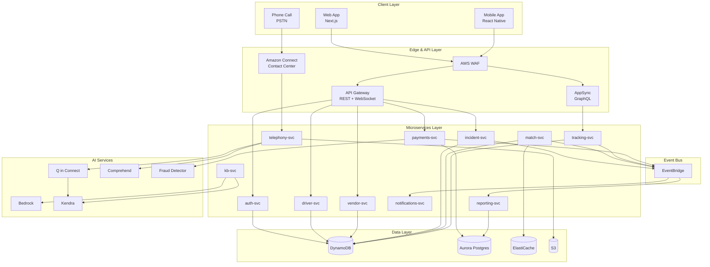
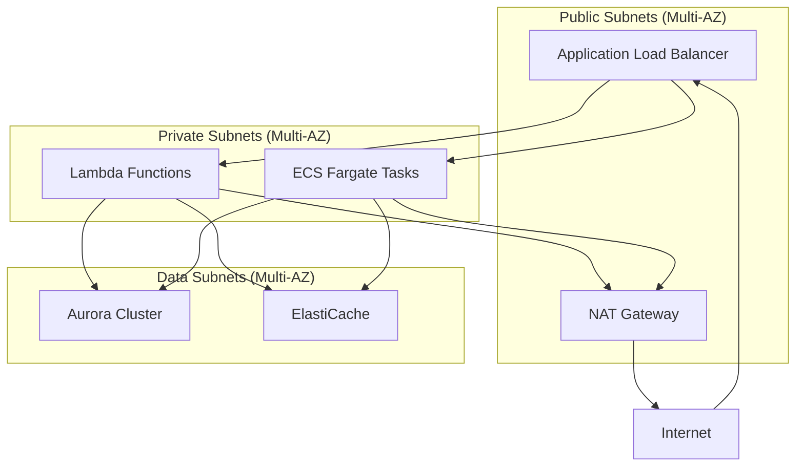
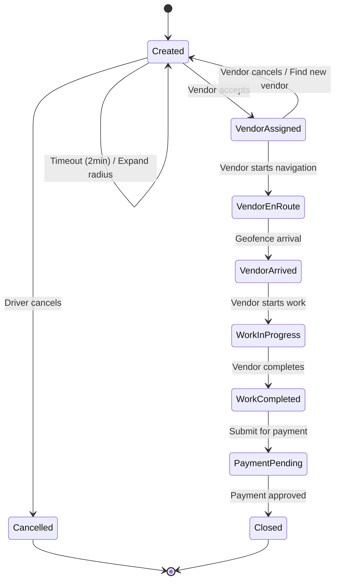
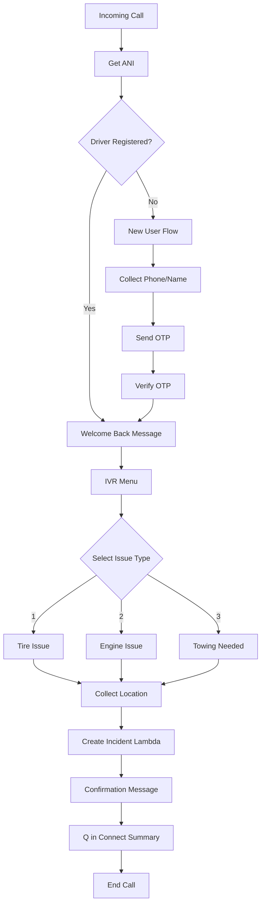
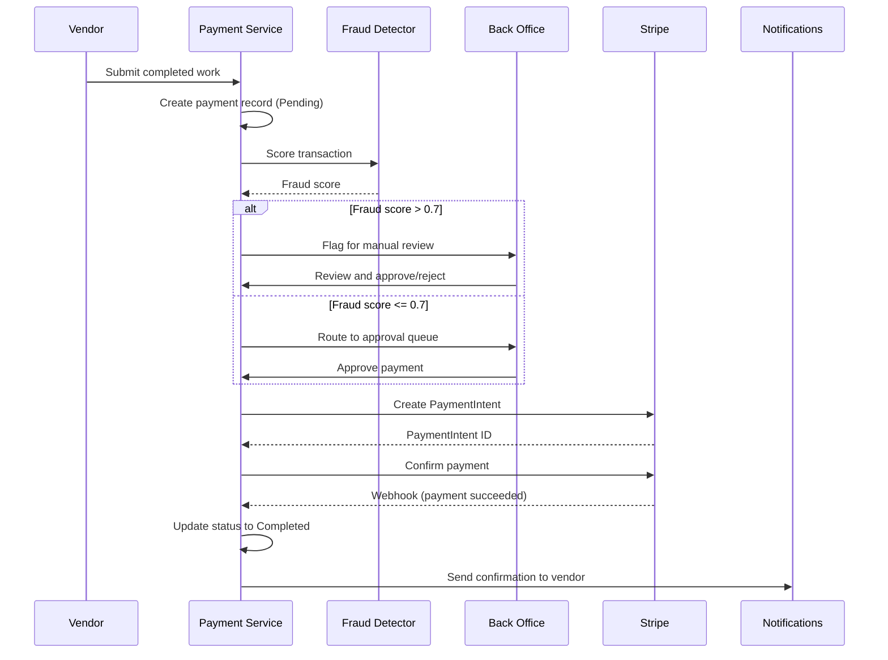
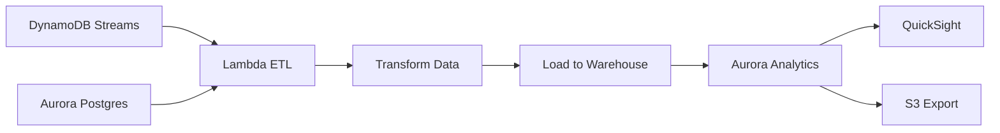
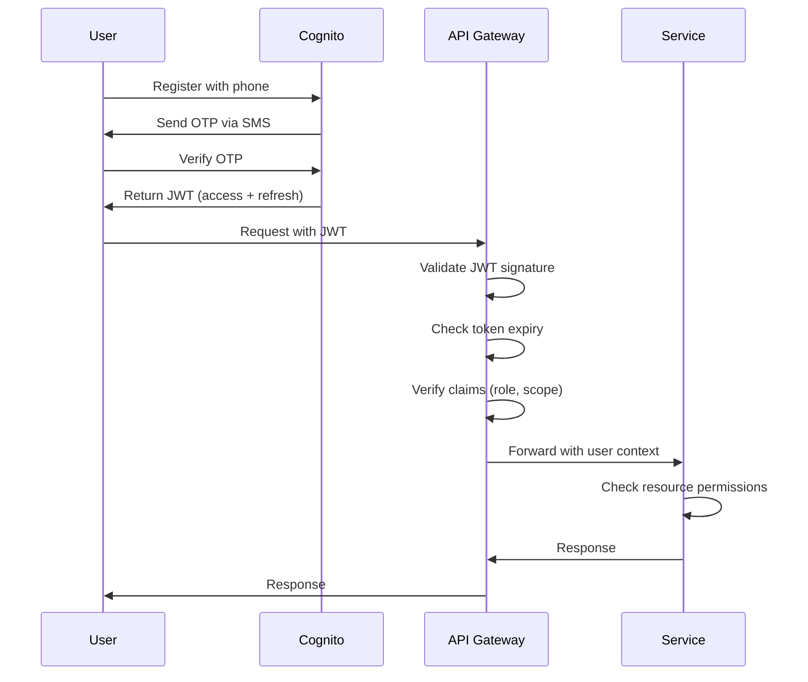

# Design Document

## Overview

The AI Roadcall Assistant is a cloud-native, event-driven platform built on AWS that connects truck drivers with roadside service vendors in real-time. The system uses a microservices architecture with 11 independent services communicating via EventBridge and API Gateway, leveraging AWS AI services (Amazon Connect, Q in Connect, Bedrock, Kendra) for intelligent call handling and Amazon Location Service for geospatial operations.

### Design Principles

1. **Security First**: Zero-trust architecture with encrypted data at rest and in transit, least-privilege IAM, and comprehensive audit logging
2. **Microservices Isolation**: Each service owns its data store, communicates via events for async operations, and uses API Gateway for sync calls
3. **Event-Driven**: Domain events published to EventBridge enable loose coupling and independent service scaling
4. **Resilience**: Circuit breakers, bulkheads, health checks, and multi-AZ deployment ensure high availability
5. **Observability**: X-Ray tracing, CloudWatch metrics, and structured logging provide full system visibility
6. **Scalability**: Serverless-first approach with Lambda, DynamoDB on-demand, and auto-scaling where needed

### Technology Stack

- **Compute**: AWS Lambda (Node.js/TypeScript), ECS Fargate (long-running services)
- **API Layer**: API Gateway (REST + WebSocket), AWS AppSync (GraphQL)
- **Data Stores**: DynamoDB (incidents, tracking, offers), Aurora Postgres (billing, analytics), ElastiCache (Redis)
- **AI/ML**: Amazon Connect, Q in Connect, Bedrock (Claude), Kendra, Comprehend, Fraud Detector
- **Geospatial**: AWS Location Service (Places, Routes, Tracking, Geofences)
- **Messaging**: EventBridge, SQS, SNS, Pinpoint
- **Storage**: S3 (call recordings, documents, artifacts), S3 Glacier (archives)
- **Auth**: Cognito User Pools, IAM
- **Observability**: CloudWatch, X-Ray, CloudTrail
- **Security**: WAF, Secrets Manager, KMS, GuardDuty
- **Frontend**: Next.js (web), React Native + Expo (mobile), MapLibre GL JS
- **IaC**: AWS CDK (TypeScript)
- **Monorepo**: Turborepo + pnpm

## Architecture

### High-Level Architecture Diagram




### Network Architecture



**Network Design**:
- VPC with 3 subnet tiers across 2 availability zones
- Public subnets: ALB, NAT Gateway
- Private subnets: Lambda, ECS (no direct internet access)
- Data subnets: Aurora, ElastiCache (isolated)
- Security groups enforce least-privilege access between tiers
- VPC endpoints for AWS services (S3, DynamoDB, Secrets Manager) to avoid NAT costs
- Transit Gateway for multi-region disaster recovery (future)

## Components and Interfaces

### 1. Authentication Service (auth-svc)

**Responsibilities**:
- User registration and phone verification
- OTP generation and validation
- JWT token issuance and refresh
- Role-based access control (RBAC)

**Technology**: Lambda + Cognito User Pools + DynamoDB

**API Endpoints**:
- `POST /auth/register` - Create user account, send OTP
- `POST /auth/verify` - Validate OTP, issue JWT
- `POST /auth/refresh` - Refresh access token
- `GET /auth/me` - Get current user profile

**Data Model**:
```typescript
interface User {
  userId: string;           // PK
  phone: string;            // GSI
  role: 'driver' | 'vendor' | 'dispatcher' | 'admin';
  name: string;
  email?: string;
  companyId?: string;       // For drivers/dispatchers
  truckNumber?: string;     // For drivers
  createdAt: string;
  lastLoginAt: string;
}

interface OTPSession {
  phone: string;            // PK
  otp: string;              // Hashed
  expiresAt: number;        // TTL
  attempts: number;
}
```

**Security**:
- OTP hashed with bcrypt before storage
- Rate limiting: 5 OTP requests per phone per hour
- JWT signed with RS256, 15-minute expiry
- Refresh tokens stored in Cognito with 30-day expiry

**Integration Points**:
- Cognito: User pool management, JWT validation
- SNS: SMS delivery via Pinpoint
- EventBridge: UserRegistered, UserVerified events


### 2. Incident Service (incident-svc)

**Responsibilities**:
- Create and manage incident lifecycle
- Store incident metadata and artifacts
- Coordinate state transitions via Step Functions
- Provide incident query and search capabilities

**Technology**: Lambda + DynamoDB + Step Functions + S3

**API Endpoints**:
- `POST /incidents` - Create new incident
- `GET /incidents/{id}` - Get incident details
- `PATCH /incidents/{id}/status` - Update incident status
- `POST /incidents/{id}/media` - Upload photos/videos
- `GET /incidents?driverId={id}&status={status}` - Query incidents

**Data Model**:
```typescript
interface Incident {
  incidentId: string;                    // PK
  driverId: string;                      // GSI
  type: 'tire' | 'engine' | 'tow';
  status: IncidentStatus;
  location: {
    lat: number;
    lon: number;
    address: string;
    roadSnapped: { lat: number; lon: number };
  };
  weather?: {
    condition: string;
    temperature: number;
    visibility: number;
  };
  assignedVendorId?: string;
  createdAt: string;
  updatedAt: string;
  timeline: StateTransition[];
  media: MediaArtifact[];
  callRecordingUrl?: string;
  transcriptId?: string;
  summaryId?: string;
}

type IncidentStatus = 
  | 'created' 
  | 'vendor_assigned' 
  | 'vendor_en_route' 
  | 'vendor_arrived' 
  | 'work_in_progress' 
  | 'work_completed' 
  | 'payment_pending' 
  | 'closed' 
  | 'cancelled';

interface StateTransition {
  from: IncidentStatus;
  to: IncidentStatus;
  timestamp: string;
  actor: string;
  reason?: string;
}

interface MediaArtifact {
  mediaId: string;
  type: 'photo' | 'video' | 'document';
  s3Key: string;
  uploadedBy: string;
  uploadedAt: string;
  metadata?: Record<string, any>;
}
```

**State Machine (Step Functions)**:


**Business Logic**:
- Incident creation triggers IncidentCreated event
- Step Functions orchestrates timeout handling (2-min vendor response, 30-min arrival)
- Automatic escalation to dispatcher if no vendor found after 3 radius expansions
- Media uploads scanned with GuardDuty before storage

**Integration Points**:
- EventBridge: IncidentCreated, IncidentStatusChanged events
- Location Service: Road snapping, weather API
- S3: Media storage with presigned URLs
- Match Service: Triggered on IncidentCreated event


### 3. Vendor Service (vendor-svc)

**Responsibilities**:
- Manage vendor profiles and capabilities
- Track vendor availability and status
- Store vendor ratings and performance metrics
- Handle vendor onboarding and verification

**Technology**: Lambda + DynamoDB + ElastiCache

**API Endpoints**:
- `POST /vendors` - Register new vendor
- `GET /vendors/{id}` - Get vendor profile
- `PATCH /vendors/{id}` - Update vendor profile
- `PATCH /vendors/{id}/availability` - Update availability status
- `GET /vendors/search?lat={lat}&lon={lon}&radius={miles}&capability={type}` - Geospatial search

**Data Model**:
```typescript
interface Vendor {
  vendorId: string;                      // PK
  businessName: string;
  contactName: string;
  phone: string;
  email: string;
  capabilities: ServiceCapability[];
  coverageArea: {
    center: { lat: number; lon: number };
    radiusMiles: number;
    geofenceIds: string[];
  };
  availability: {
    status: 'available' | 'busy' | 'offline';
    currentIncidentId?: string;
    lastUpdated: string;
  };
  operatingHours: {
    [day: string]: { open: string; close: string };
  };
  rating: {
    average: number;
    count: number;
  };
  metrics: {
    acceptanceRate: number;
    avgResponseTime: number;
    completionRate: number;
    totalJobs: number;
  };
  pricing: {
    [serviceType: string]: {
      basePrice: number;
      perMileRate: number;
    };
  };
  certifications: string[];
  insuranceExpiry: string;
  backgroundCheckStatus: 'pending' | 'approved' | 'rejected';
  createdAt: string;
  verifiedAt?: string;
}

type ServiceCapability = 'tire_repair' | 'tire_replacement' | 'engine_repair' | 'towing' | 'jumpstart' | 'fuel_delivery';
```

**Caching Strategy**:
- Vendor profiles cached in Redis with 5-minute TTL
- Geospatial index maintained in Redis using GEOADD/GEORADIUS
- Cache invalidation on vendor profile updates
- Cache warming for high-traffic regions

**Geospatial Indexing**:
- DynamoDB GSI on geohash for coarse filtering
- Redis GEORADIUS for precise distance calculations
- Fallback to DynamoDB scan if Redis unavailable

**Integration Points**:
- EventBridge: VendorRegistered, VendorStatusChanged events
- Match Service: Provides vendor candidates for matching
- Notifications Service: Availability alerts


### 4. Match Service (match-svc)

**Responsibilities**:
- Execute vendor matching algorithm
- Create and distribute offers to vendors
- Handle offer acceptance/decline/timeout
- Implement fallback and escalation logic

**Technology**: Lambda + DynamoDB + SQS + ElastiCache

**API Endpoints**:
- `POST /matches` - Trigger matching (internal, event-driven)
- `GET /offers/{id}` - Get offer details
- `POST /offers/{id}/accept` - Vendor accepts offer
- `POST /offers/{id}/decline` - Vendor declines offer

**Data Model**:
```typescript
interface Offer {
  offerId: string;                       // PK
  incidentId: string;                    // GSI
  vendorId: string;                      // GSI
  status: 'pending' | 'accepted' | 'declined' | 'expired' | 'cancelled';
  matchScore: number;
  scoreBreakdown: {
    distance: number;
    capability: number;
    availability: number;
    acceptanceRate: number;
    rating: number;
  };
  estimatedPayout: number;
  expiresAt: number;                     // TTL
  createdAt: string;
  respondedAt?: string;
  declineReason?: string;
}

interface MatchRequest {
  incidentId: string;
  location: { lat: number; lon: number };
  serviceType: ServiceCapability;
  radiusMiles: number;
  attempt: number;
}
```

**Matching Algorithm**:

```typescript
function calculateMatchScore(
  vendor: Vendor,
  incident: Incident,
  config: MatchConfig
): number {
  const weights = {
    distance: 0.30,
    capability: 0.25,
    availability: 0.20,
    acceptanceRate: 0.15,
    rating: 0.10
  };

  // Distance score (inverse, normalized to 0-1)
  const distanceMiles = calculateDistance(vendor.location, incident.location);
  const distanceScore = Math.max(0, 1 - (distanceMiles / config.maxRadius));

  // Capability score (exact match = 1, related = 0.5)
  const capabilityScore = vendor.capabilities.includes(incident.type) ? 1 : 0;

  // Availability score
  const availabilityScore = vendor.availability.status === 'available' ? 1 : 0;

  // Historical acceptance rate (0-1)
  const acceptanceScore = vendor.metrics.acceptanceRate;

  // Rating score (normalized to 0-1)
  const ratingScore = vendor.rating.average / 5;

  return (
    weights.distance * distanceScore +
    weights.capability * capabilityScore +
    weights.availability * availabilityScore +
    weights.acceptanceRate * acceptanceScore +
    weights.rating * ratingScore
  );
}
```

**Matching Flow**:
1. Receive IncidentCreated event from EventBridge
2. Query vendors within radius using geospatial index
3. Filter by capability and availability
4. Calculate match scores for all candidates
5. Rank vendors and select top 3
6. Create offers with 2-minute TTL
7. Publish OfferCreated events (triggers notifications)
8. Wait for acceptance or timeout
9. If timeout, expand radius by 25% and retry (max 3 attempts)
10. If no vendor found after 3 attempts, escalate to dispatcher

**Concurrency Control**:
- Optimistic locking on incident status using DynamoDB conditional writes
- Prevents multiple vendors from accepting same incident
- First successful accept wins, others receive conflict error

**Integration Points**:
- EventBridge: Subscribes to IncidentCreated, publishes OfferCreated, OfferAccepted
- Vendor Service: Queries vendor availability
- Notifications Service: Triggers push/SMS to vendors
- SQS: Dead-letter queue for failed matches


### 5. Tracking Service (tracking-svc)

**Responsibilities**:
- Manage real-time location tracking sessions
- Calculate ETAs using AWS Location Service
- Detect arrival via geofencing
- Provide GraphQL subscriptions for live updates

**Technology**: AppSync + Lambda + DynamoDB + AWS Location Service

**GraphQL Schema**:
```graphql
type TrackingSession {
  sessionId: ID!
  incidentId: ID!
  driverId: ID!
  vendorId: ID!
  status: TrackingStatus!
  driverLocation: Location!
  vendorLocation: Location!
  vendorRoute: [Location!]!
  eta: ETA!
  createdAt: AWSDateTime!
  updatedAt: AWSDateTime!
}

type Location {
  lat: Float!
  lon: Float!
  timestamp: AWSDateTime!
  accuracy: Float
}

type ETA {
  minutes: Int!
  distance: Float!
  arrivalTime: AWSDateTime!
  confidence: Float!
}

enum TrackingStatus {
  ACTIVE
  ARRIVED
  COMPLETED
  CANCELLED
}

type Mutation {
  startTracking(incidentId: ID!): TrackingSession!
  updateVendorLocation(sessionId: ID!, location: LocationInput!): TrackingSession!
  stopTracking(sessionId: ID!): TrackingSession!
}

type Query {
  getTrackingSession(sessionId: ID!): TrackingSession
  getActiveSessionByIncident(incidentId: ID!): TrackingSession
}

type Subscription {
  onTrackingUpdate(sessionId: ID!): TrackingSession
    @aws_subscribe(mutations: ["updateVendorLocation"])
  onIncidentTracking(incidentId: ID!): TrackingSession
    @aws_subscribe(mutations: ["updateVendorLocation", "startTracking", "stopTracking"])
}
```

**Data Model**:
```typescript
interface TrackingSession {
  sessionId: string;                     // PK
  incidentId: string;                    // GSI
  driverId: string;
  vendorId: string;
  status: TrackingStatus;
  driverLocation: LocationPoint;
  vendorLocation: LocationPoint;
  vendorPath: LocationPoint[];           // Last 50 points
  route: RouteSegment[];
  eta: ETACalculation;
  geofenceId: string;                    // For arrival detection
  createdAt: string;
  updatedAt: string;
}

interface LocationPoint {
  lat: number;
  lon: number;
  timestamp: string;
  accuracy?: number;
  speed?: number;
  heading?: number;
}

interface ETACalculation {
  minutes: number;
  distanceMiles: number;
  arrivalTime: string;
  confidence: number;
  calculatedAt: string;
}
```

**ETA Calculation**:
- Use AWS Location Service Routes API for real-time routing
- Recalculate ETA every 30 seconds or on significant location change (>0.1 miles)
- Factor in traffic conditions from Location Service
- Confidence score based on route stability and traffic data quality

**Geofencing for Arrival Detection**:
- Create 100-meter radius geofence around incident location
- Register geofence with AWS Location Service Tracker
- Automatic notification when vendor enters geofence
- Triggers incident status update to "Vendor Arrived"

**Performance Optimization**:
- Location updates batched every 10 seconds
- AppSync caching with 5-second TTL for high-traffic sessions
- DynamoDB Streams trigger Lambda for ETA recalculation
- Vendor path stored as circular buffer (max 50 points)

**Integration Points**:
- AWS Location Service: Routing, geofencing, tracking
- EventBridge: VendorArrived, TrackingStarted events
- AppSync: Real-time subscriptions to mobile/web clients
- Incident Service: Status updates on arrival


### 6. Telephony Service (telephony-svc)

**Responsibilities**:
- Integrate with Amazon Connect for call handling
- Process call recordings and transcriptions
- Generate AI summaries via Q in Connect
- Redact PII from transcripts
- Link calls to incidents

**Technology**: Lambda + Amazon Connect + S3 + Comprehend + Q in Connect

**Amazon Connect Flow**:


**Call Processing Pipeline**:
1. Call ends → Contact Flow triggers Lambda
2. Lambda retrieves call recording from S3
3. Start transcription job (Amazon Transcribe via Connect)
4. Transcription complete → trigger PII redaction (Comprehend)
5. Send redacted transcript to Q in Connect for summarization
6. Store summary, transcript, and recording URLs in incident record
7. Publish CallProcessed event

**Data Model**:
```typescript
interface CallRecord {
  callId: string;                        // PK (Connect ContactId)
  incidentId?: string;                   // GSI
  driverId?: string;
  phone: string;
  direction: 'inbound' | 'outbound';
  duration: number;
  recordingUrl: string;                  // S3 presigned URL
  transcriptId?: string;
  summaryId?: string;
  startTime: string;
  endTime: string;
  disposition: string;
}

interface Transcript {
  transcriptId: string;                  // PK
  callId: string;                        // GSI
  incidentId?: string;
  rawText: string;                       // Original
  redactedText: string;                  // PII removed
  piiEntities: PIIEntity[];
  confidence: number;
  createdAt: string;
}

interface CallSummary {
  summaryId: string;                     // PK
  callId: string;
  incidentId?: string;
  summary: string;
  incidentType?: string;
  urgency: 'low' | 'medium' | 'high' | 'critical';
  actionItems: string[];
  sentiment: 'positive' | 'neutral' | 'negative';
  keyPhrases: string[];
  generatedAt: string;
}
```

**Q in Connect Integration**:
- Real-time agent assist during calls (knowledge base queries)
- Post-call summarization with structured output
- Action item extraction
- Sentiment analysis
- Prompt template:
```
Analyze this roadside assistance call transcript and provide:
1. Brief summary (2-3 sentences)
2. Incident type (tire/engine/tow)
3. Urgency level (low/medium/high/critical)
4. Action items for dispatcher
5. Driver sentiment

Transcript: {redacted_transcript}
```

**PII Redaction**:
- Comprehend DetectPiiEntities API
- Redact: names, addresses, SSN, credit cards, phone numbers (except registered)
- Store mapping for authorized access (encrypted in DynamoDB)
- Audit log all PII access

**Integration Points**:
- Amazon Connect: Contact flows, call recordings
- S3: Recording storage with lifecycle policies (90-day retention)
- Kendra: Knowledge base queries during calls
- EventBridge: CallStarted, CallEnded, TranscriptReady events
- Incident Service: Link calls to incidents


### 7. Knowledge Base Service (kb-svc)

**Responsibilities**:
- Manage knowledge base documents (SOPs, vendor SLAs, troubleshooting guides)
- Index documents in Kendra
- Provide RAG capabilities via Bedrock
- Handle document uploads and processing

**Technology**: Lambda + S3 + Kendra + Bedrock + Textract

**API Endpoints**:
- `POST /kb/documents` - Upload document
- `GET /kb/documents/{id}` - Get document metadata
- `DELETE /kb/documents/{id}` - Remove document
- `POST /kb/search` - Search knowledge base
- `POST /kb/query` - RAG query with LLM

**Document Processing Pipeline**:


**Data Model**:
```typescript
interface KBDocument {
  documentId: string;                    // PK
  title: string;
  category: 'sop' | 'vendor_sla' | 'troubleshooting' | 'policy';
  s3Key: string;
  s3Bucket: string;
  fileType: string;
  fileSize: number;
  kendraDocumentId?: string;
  indexStatus: 'pending' | 'indexed' | 'failed';
  uploadedBy: string;
  uploadedAt: string;
  lastIndexedAt?: string;
  metadata: {
    tags: string[];
    version: string;
    effectiveDate?: string;
    expiryDate?: string;
  };
}
```

**Kendra Configuration**:
- Index name: `roadcall-kb-{environment}`
- Data source: S3 connector with metadata mapping
- Custom attributes: category, tags, effectiveDate
- Relevance tuning: boost recent documents, prioritize SOPs
- Synonyms: tire/tyre, tow/towing, breakdown/failure

**RAG Implementation**:
```typescript
async function ragQuery(query: string, context: RAGContext): Promise<RAGResponse> {
  // 1. Search Kendra for relevant documents
  const kendraResults = await kendra.query({
    IndexId: KENDRA_INDEX_ID,
    QueryText: query,
    AttributeFilter: {
      EqualsTo: {
        Key: 'category',
        Value: { StringValue: context.category }
      }
    }
  });

  // 2. Extract top 3 passages
  const passages = kendraResults.ResultItems
    .slice(0, 3)
    .map(item => item.DocumentExcerpt.Text);

  // 3. Build prompt with context
  const prompt = `
    Context from knowledge base:
    ${passages.join('\n\n')}
    
    User question: ${query}
    
    Provide a concise answer based on the context above. If the context doesn't contain relevant information, say so.
  `;

  // 4. Query Bedrock (Claude)
  const bedrockResponse = await bedrock.invokeModel({
    modelId: 'anthropic.claude-3-sonnet-20240229-v1:0',
    body: JSON.stringify({
      anthropic_version: 'bedrock-2023-05-31',
      max_tokens: 500,
      messages: [{
        role: 'user',
        content: prompt
      }]
    })
  });

  return {
    answer: bedrockResponse.content[0].text,
    sources: kendraResults.ResultItems.map(item => ({
      title: item.DocumentTitle,
      excerpt: item.DocumentExcerpt.Text,
      confidence: item.ScoreAttributes.ScoreConfidence
    }))
  };
}
```

**Prompt Guardrails**:
- Bedrock Guardrails to filter harmful content
- Content filters: hate speech, violence, sexual content
- PII filters: prevent leaking sensitive data in responses
- Topic filters: stay within roadside assistance domain

**Integration Points**:
- S3: Document storage with versioning
- Kendra: Full-text search and semantic search
- Bedrock: LLM for RAG responses
- Textract: PDF/image text extraction
- Q in Connect: Real-time knowledge queries during calls


### 8. Payments Service (payments-svc)

**Responsibilities**:
- Process vendor payments via Stripe
- Handle back-office approval workflows
- Support IC driver direct payments
- Fraud detection and prevention
- Payment reconciliation and reporting

**Technology**: Lambda + Aurora Postgres + Stripe + Fraud Detector + SQS

**API Endpoints**:
- `POST /payments` - Create payment record
- `GET /payments/{id}` - Get payment details
- `POST /payments/{id}/approve` - Back-office approval
- `POST /payments/{id}/process` - Process payment via Stripe
- `GET /payments/pending` - Get pending approvals queue
- `POST /payments/webhooks/stripe` - Stripe webhook handler

**Data Model (Aurora Postgres)**:
```sql
CREATE TABLE payments (
  payment_id UUID PRIMARY KEY,
  incident_id UUID NOT NULL,
  vendor_id UUID NOT NULL,
  payer_type VARCHAR(20) NOT NULL, -- 'back_office' | 'driver_ic'
  payer_id UUID,
  amount_cents INTEGER NOT NULL,
  currency VARCHAR(3) DEFAULT 'USD',
  status VARCHAR(20) NOT NULL,
  stripe_payment_intent_id VARCHAR(255),
  fraud_score DECIMAL(3,2),
  fraud_status VARCHAR(20),
  approved_by UUID,
  approved_at TIMESTAMP,
  processed_at TIMESTAMP,
  failed_reason TEXT,
  metadata JSONB,
  created_at TIMESTAMP DEFAULT NOW(),
  updated_at TIMESTAMP DEFAULT NOW()
);

CREATE TABLE payment_line_items (
  line_item_id UUID PRIMARY KEY,
  payment_id UUID REFERENCES payments(payment_id),
  description VARCHAR(255) NOT NULL,
  quantity INTEGER DEFAULT 1,
  unit_price_cents INTEGER NOT NULL,
  total_cents INTEGER NOT NULL
);

CREATE TABLE payment_audit_log (
  log_id UUID PRIMARY KEY,
  payment_id UUID REFERENCES payments(payment_id),
  action VARCHAR(50) NOT NULL,
  actor_id UUID NOT NULL,
  actor_type VARCHAR(20) NOT NULL,
  previous_status VARCHAR(20),
  new_status VARCHAR(20),
  notes TEXT,
  timestamp TIMESTAMP DEFAULT NOW()
);

CREATE INDEX idx_payments_status ON payments(status);
CREATE INDEX idx_payments_incident ON payments(incident_id);
CREATE INDEX idx_payments_vendor ON payments(vendor_id);
```

**Payment Flow**:



**Fraud Detection**:
```typescript
async function scoreFraudRisk(payment: Payment): Promise<FraudScore> {
  const fraudDetectorInput = {
    eventId: payment.paymentId,
    eventTypeName: 'vendor_payment',
    eventTimestamp: new Date().toISOString(),
    eventVariables: {
      amount: payment.amountCents / 100,
      vendor_id: payment.vendorId,
      incident_id: payment.incidentId,
      vendor_account_age_days: await getVendorAccountAge(payment.vendorId),
      vendor_total_payments: await getVendorPaymentCount(payment.vendorId),
      payment_velocity_24h: await getPaymentVelocity(payment.vendorId, 24),
      incident_duration_minutes: await getIncidentDuration(payment.incidentId)
    }
  };

  const result = await fraudDetector.getPrediction(fraudDetectorInput);
  
  return {
    score: result.modelScores[0].scores.fraud_score,
    riskLevel: result.ruleResults[0].outcomes[0],
    reasons: result.ruleResults.map(r => r.ruleName)
  };
}
```

**Stripe Integration**:
- Use Stripe Connect for vendor payouts
- Payment Intents API for IC driver payments
- Webhook signature verification (HMAC)
- Idempotency keys for retry safety
- Automatic retry with exponential backoff

**Back-Office Approval Workflow**:
- Payments routed to SQS queue by company/region
- Dispatchers poll queue via API
- Approval requires: incident review, photo verification, pricing validation
- Approval logged in audit table
- Rejected payments trigger vendor notification with reason

**Integration Points**:
- Stripe: Payment processing, Connect payouts
- Fraud Detector: Risk scoring
- EventBridge: PaymentCreated, PaymentApproved, PaymentCompleted events
- SQS: Approval queue with DLQ
- Notifications Service: Payment confirmations


### 9. Notifications Service (notifications-svc)

**Responsibilities**:
- Send push notifications to mobile apps
- Send SMS via Pinpoint
- Send emails via SES
- Manage notification preferences
- Handle notification templates

**Technology**: Lambda + SQS + Pinpoint + SES + DynamoDB

**Notification Types**:
```typescript
type NotificationType = 
  | 'offer_received'           // Vendor: new job offer
  | 'offer_accepted'           // Driver: vendor assigned
  | 'vendor_en_route'          // Driver: vendor started navigation
  | 'vendor_arrived'           // Driver: vendor at location
  | 'work_started'             // Driver: work in progress
  | 'work_completed'           // Driver: work done
  | 'payment_approved'         // Vendor: payment processed
  | 'incident_cancelled'       // Vendor: incident cancelled
  | 'otp_code'                 // User: authentication OTP
  | 'system_alert';            // Admin: system issues

interface NotificationRequest {
  type: NotificationType;
  recipientId: string;
  recipientType: 'driver' | 'vendor' | 'dispatcher' | 'admin';
  channels: ('push' | 'sms' | 'email')[];
  priority: 'low' | 'normal' | 'high' | 'urgent';
  data: Record<string, any>;
  templateId?: string;
  scheduledFor?: string;
}
```

**Event-Driven Architecture**:
- Subscribe to EventBridge events (OfferCreated, VendorAssigned, etc.)
- SQS queue for buffering and retry
- Priority queue for urgent notifications (OTP, offers)
- Dead-letter queue for failed deliveries

**Notification Templates**:
```typescript
const templates = {
  offer_received: {
    push: {
      title: 'New Job Offer',
      body: 'New {{incidentType}} job {{distance}} miles away. Payout: ${{payout}}',
      data: { incidentId: '{{incidentId}}', offerId: '{{offerId}}' }
    },
    sms: 'New {{incidentType}} job {{distance}}mi away. Payout ${{payout}}. Accept: {{acceptUrl}}'
  },
  vendor_en_route: {
    push: {
      title: 'Help is on the way!',
      body: '{{vendorName}} is heading to your location. ETA: {{eta}} minutes',
      data: { incidentId: '{{incidentId}}', trackingSessionId: '{{sessionId}}' }
    }
  }
  // ... more templates
};
```

**Delivery Logic**:
```typescript
async function sendNotification(request: NotificationRequest): Promise<void> {
  // 1. Get user preferences
  const prefs = await getUserNotificationPreferences(request.recipientId);
  
  // 2. Filter channels based on preferences
  const enabledChannels = request.channels.filter(ch => 
    prefs.channels[ch]?.enabled && 
    !prefs.mutedTypes.includes(request.type)
  );

  // 3. Get contact info
  const contact = await getUserContact(request.recipientId);

  // 4. Render template
  const template = templates[request.type];
  const rendered = renderTemplate(template, request.data);

  // 5. Send via each channel (parallel)
  await Promise.allSettled([
    enabledChannels.includes('push') && sendPush(contact.deviceTokens, rendered.push),
    enabledChannels.includes('sms') && sendSMS(contact.phone, rendered.sms),
    enabledChannels.includes('email') && sendEmail(contact.email, rendered.email)
  ]);

  // 6. Log delivery
  await logNotification(request, enabledChannels);
}
```

**Push Notifications (Pinpoint)**:
- Segment users by role (driver/vendor/dispatcher)
- Device token management (iOS/Android)
- Badge count tracking
- Silent notifications for background updates

**SMS (Pinpoint)**:
- E.164 phone number validation
- Opt-out handling (STOP keyword)
- Rate limiting: 10 SMS per user per hour
- Cost tracking per message

**Email (SES)**:
- HTML templates with inline CSS
- Unsubscribe link in footer
- Bounce and complaint handling
- DKIM/SPF configuration

**Notification Preferences**:
```typescript
interface NotificationPreferences {
  userId: string;
  channels: {
    push: { enabled: boolean };
    sms: { enabled: boolean };
    email: { enabled: boolean };
  };
  mutedTypes: NotificationType[];
  quietHours?: {
    start: string;  // HH:mm
    end: string;
    timezone: string;
  };
  updatedAt: string;
}
```

**Integration Points**:
- EventBridge: Subscribe to all domain events
- Pinpoint: Push and SMS delivery
- SES: Email delivery
- SQS: Notification queue with priority
- User Service: Contact info and preferences


### 10. Reporting Service (reporting-svc)

**Responsibilities**:
- Generate business intelligence reports
- Track KPIs and metrics
- Provide analytics dashboards
- Export data for external BI tools

**Technology**: Lambda + Aurora Postgres + QuickSight + S3

**Key Metrics**:
```typescript
interface KPIs {
  // Operational
  timeToAssign: number;              // Avg time from incident to vendor assigned
  timeToArrival: number;             // Avg time from assigned to vendor arrived
  firstAttemptResolution: number;    // % incidents resolved without escalation
  vendorAcceptanceRate: number;      // % offers accepted vs sent
  
  // Financial
  costPerIncident: number;           // Avg payment per incident
  revenuePerVendor: number;          // Avg revenue per vendor
  paymentApprovalTime: number;       // Avg time to approve payments
  
  // Quality
  driverSatisfaction: number;        // CSAT score
  vendorRating: number;              // Avg vendor rating
  incidentResolutionRate: number;    // % incidents successfully closed
  
  // System
  apiLatencyP95: number;             // 95th percentile API latency
  systemUptime: number;              // % uptime
  errorRate: number;                 // % failed requests
}
```

**Data Warehouse Schema**:
```sql
-- Fact table: Incidents
CREATE TABLE fact_incidents (
  incident_id UUID PRIMARY KEY,
  driver_id UUID,
  vendor_id UUID,
  incident_type VARCHAR(20),
  status VARCHAR(20),
  created_at TIMESTAMP,
  assigned_at TIMESTAMP,
  arrived_at TIMESTAMP,
  completed_at TIMESTAMP,
  closed_at TIMESTAMP,
  time_to_assign_seconds INTEGER,
  time_to_arrival_seconds INTEGER,
  total_duration_seconds INTEGER,
  distance_miles DECIMAL(10,2),
  payment_amount_cents INTEGER,
  driver_rating INTEGER,
  vendor_rating INTEGER,
  resolution_type VARCHAR(20),
  escalated BOOLEAN,
  date_key INTEGER,
  hour_key INTEGER
);

-- Dimension: Vendors
CREATE TABLE dim_vendors (
  vendor_id UUID PRIMARY KEY,
  business_name VARCHAR(255),
  capabilities TEXT[],
  region VARCHAR(50),
  avg_rating DECIMAL(3,2),
  total_jobs INTEGER,
  acceptance_rate DECIMAL(5,2),
  active BOOLEAN
);

-- Dimension: Drivers
CREATE TABLE dim_drivers (
  driver_id UUID PRIMARY KEY,
  company_id UUID,
  company_name VARCHAR(255),
  region VARCHAR(50),
  total_incidents INTEGER,
  active BOOLEAN
);

-- Dimension: Date
CREATE TABLE dim_date (
  date_key INTEGER PRIMARY KEY,
  date DATE,
  day_of_week VARCHAR(10),
  week_of_year INTEGER,
  month INTEGER,
  quarter INTEGER,
  year INTEGER,
  is_weekend BOOLEAN,
  is_holiday BOOLEAN
);
```

**ETL Pipeline**:


**Report Types**:

1. **Executive Dashboard**:
   - Daily/weekly/monthly KPI trends
   - Regional performance comparison
   - Top vendors by volume and rating
   - Cost analysis

2. **Operational Reports**:
   - Active incidents map view
   - Vendor utilization heatmap
   - Response time distribution
   - Escalation analysis

3. **Financial Reports**:
   - Payment reconciliation
   - Vendor payout summary
   - Cost per incident by type
   - Revenue by region

4. **Vendor Performance**:
   - Acceptance rate trends
   - Average response time
   - Customer ratings
   - Completion rate

**API Endpoints**:
- `GET /reports/kpis?period={daily|weekly|monthly}` - Get KPI summary
- `GET /reports/incidents?from={date}&to={date}` - Incident analytics
- `GET /reports/vendors/{id}/performance` - Vendor performance report
- `POST /reports/export` - Export data to S3 (CSV/Parquet)

**Real-Time Metrics**:
- CloudWatch custom metrics for operational KPIs
- Lambda triggered on EventBridge events to update metrics
- 5-minute aggregation windows
- Alarms for SLA violations

**Integration Points**:
- DynamoDB Streams: Real-time data ingestion
- Aurora Postgres: Data warehouse
- QuickSight: BI dashboards
- S3: Report exports
- EventBridge: Metric updates on domain events


### 11. Driver Service (driver-svc)

**Responsibilities**:
- Manage driver profiles and company associations
- Track driver incident history
- Handle driver preferences and settings
- Provide driver-specific data access

**Technology**: Lambda + DynamoDB + ElastiCache

**API Endpoints**:
- `GET /drivers/{id}` - Get driver profile
- `PATCH /drivers/{id}` - Update driver profile
- `GET /drivers/{id}/incidents` - Get driver incident history
- `GET /drivers/{id}/preferences` - Get driver preferences
- `PATCH /drivers/{id}/preferences` - Update preferences

**Data Model**:
```typescript
interface Driver {
  driverId: string;                      // PK
  userId: string;                        // FK to auth service
  phone: string;
  name: string;
  email?: string;
  companyId: string;
  companyName: string;
  truckNumber: string;
  licenseNumber?: string;
  licenseState?: string;
  paymentType: 'company' | 'independent_contractor';
  preferences: {
    language: string;
    notifications: NotificationPreferences;
    autoShareLocation: boolean;
  };
  stats: {
    totalIncidents: number;
    avgRating: number;
    lastIncidentAt?: string;
  };
  status: 'active' | 'inactive' | 'suspended';
  createdAt: string;
  updatedAt: string;
}
```

## Data Models

### DynamoDB Table Design

**Table: Users** (auth-svc)
- PK: `userId`
- GSI1: `phone` (for ANI lookup)
- GSI2: `companyId` (for company queries)

**Table: Incidents** (incident-svc)
- PK: `incidentId`
- GSI1: `driverId#status` (driver's active incidents)
- GSI2: `vendorId#status` (vendor's active incidents)
- GSI3: `status#createdAt` (global incident queue)

**Table: Vendors** (vendor-svc)
- PK: `vendorId`
- GSI1: `geohash#availability` (geospatial queries)
- GSI2: `rating` (top-rated vendors)

**Table: Offers** (match-svc)
- PK: `offerId`
- GSI1: `incidentId#status` (incident's offers)
- GSI2: `vendorId#status` (vendor's pending offers)
- TTL: `expiresAt` (auto-delete expired offers)

**Table: TrackingSessions** (tracking-svc)
- PK: `sessionId`
- GSI1: `incidentId` (incident's tracking session)
- GSI2: `vendorId#status` (vendor's active sessions)

**Table: CallRecords** (telephony-svc)
- PK: `callId`
- GSI1: `incidentId` (incident's calls)
- GSI2: `driverId#startTime` (driver's call history)

**Table: KBDocuments** (kb-svc)
- PK: `documentId`
- GSI1: `category#uploadedAt` (documents by category)

**Table: NotificationLog** (notifications-svc)
- PK: `notificationId`
- GSI1: `recipientId#timestamp` (user's notification history)
- TTL: `expiresAt` (auto-delete after 90 days)

### Aurora Postgres Schema

**Payments Database**:
- Tables: `payments`, `payment_line_items`, `payment_audit_log`
- Indexes: status, incident_id, vendor_id, created_at
- Partitioning: Monthly partitions on `created_at`

**Analytics Database**:
- Tables: `fact_incidents`, `dim_vendors`, `dim_drivers`, `dim_date`
- Materialized views for common aggregations
- Read replicas for reporting queries

## Error Handling

### Error Classification

```typescript
enum ErrorType {
  // Client errors (4xx)
  VALIDATION_ERROR = 'VALIDATION_ERROR',
  AUTHENTICATION_ERROR = 'AUTHENTICATION_ERROR',
  AUTHORIZATION_ERROR = 'AUTHORIZATION_ERROR',
  NOT_FOUND = 'NOT_FOUND',
  CONFLICT = 'CONFLICT',
  RATE_LIMIT_EXCEEDED = 'RATE_LIMIT_EXCEEDED',
  
  // Server errors (5xx)
  INTERNAL_ERROR = 'INTERNAL_ERROR',
  SERVICE_UNAVAILABLE = 'SERVICE_UNAVAILABLE',
  TIMEOUT = 'TIMEOUT',
  DEPENDENCY_ERROR = 'DEPENDENCY_ERROR',
  
  // Business errors
  INCIDENT_ALREADY_ASSIGNED = 'INCIDENT_ALREADY_ASSIGNED',
  VENDOR_NOT_AVAILABLE = 'VENDOR_NOT_AVAILABLE',
  PAYMENT_FAILED = 'PAYMENT_FAILED',
  FRAUD_DETECTED = 'FRAUD_DETECTED'
}

interface ErrorResponse {
  error: {
    type: ErrorType;
    message: string;
    code: string;
    details?: Record<string, any>;
    requestId: string;
    timestamp: string;
  };
}
```

### Error Handling Strategies

**Circuit Breaker Pattern**:
```typescript
class CircuitBreaker {
  private state: 'CLOSED' | 'OPEN' | 'HALF_OPEN' = 'CLOSED';
  private failureCount = 0;
  private lastFailureTime?: number;
  
  constructor(
    private threshold: number = 5,
    private timeout: number = 30000,
    private resetTimeout: number = 60000
  ) {}
  
  async execute<T>(fn: () => Promise<T>): Promise<T> {
    if (this.state === 'OPEN') {
      if (Date.now() - this.lastFailureTime! > this.resetTimeout) {
        this.state = 'HALF_OPEN';
      } else {
        throw new Error('Circuit breaker is OPEN');
      }
    }
    
    try {
      const result = await Promise.race([
        fn(),
        new Promise((_, reject) => 
          setTimeout(() => reject(new Error('Timeout')), this.timeout)
        )
      ]);
      
      if (this.state === 'HALF_OPEN') {
        this.state = 'CLOSED';
        this.failureCount = 0;
      }
      
      return result as T;
    } catch (error) {
      this.failureCount++;
      this.lastFailureTime = Date.now();
      
      if (this.failureCount >= this.threshold) {
        this.state = 'OPEN';
      }
      
      throw error;
    }
  }
}
```

**Retry Strategy**:
- Exponential backoff: 100ms, 200ms, 400ms, 800ms, 1600ms
- Max retries: 3 for idempotent operations, 0 for non-idempotent
- Jitter: ±25% to prevent thundering herd
- Retry on: 5xx errors, timeouts, network errors
- No retry on: 4xx errors (except 429), business logic errors

**Fallback Mechanisms**:
- Vendor matching: Expand radius if no matches found
- Tracking: Use last known location if real-time unavailable
- Notifications: Queue for retry if delivery fails
- Knowledge base: Return cached results if Kendra unavailable
- Payments: Queue for manual processing if Stripe unavailable

**Dead Letter Queues**:
- All SQS queues have DLQ with 3 retry attempts
- DLQ messages trigger CloudWatch alarms
- Manual review process for DLQ messages
- Automatic replay after issue resolution


## Testing Strategy

### Testing Pyramid

```
                    /\
                   /  \
                  / E2E \
                 /--------\
                /          \
               / Integration \
              /--------------\
             /                \
            /   Unit Tests     \
           /____________________\
```

### Unit Testing

**Scope**: Individual functions, business logic, utilities

**Tools**: Jest, AWS SDK mocks

**Coverage Target**: 80% code coverage

**Examples**:
```typescript
// Match score calculation
describe('calculateMatchScore', () => {
  it('should prioritize closer vendors', () => {
    const vendor1 = createVendor({ distance: 10 });
    const vendor2 = createVendor({ distance: 30 });
    const incident = createIncident();
    
    const score1 = calculateMatchScore(vendor1, incident, config);
    const score2 = calculateMatchScore(vendor2, incident, config);
    
    expect(score1).toBeGreaterThan(score2);
  });
  
  it('should require exact capability match', () => {
    const vendor = createVendor({ capabilities: ['tire_repair'] });
    const incident = createIncident({ type: 'tow' });
    
    const score = calculateMatchScore(vendor, incident, config);
    
    expect(score).toBe(0);
  });
});

// OTP validation
describe('validateOTP', () => {
  it('should accept valid OTP within expiry window', async () => {
    const phone = '+15551234567';
    await createOTPSession(phone, '123456', Date.now() + 300000);
    
    const result = await validateOTP(phone, '123456');
    
    expect(result.valid).toBe(true);
  });
  
  it('should reject expired OTP', async () => {
    const phone = '+15551234567';
    await createOTPSession(phone, '123456', Date.now() - 1000);
    
    const result = await validateOTP(phone, '123456');
    
    expect(result.valid).toBe(false);
    expect(result.reason).toBe('expired');
  });
});
```

### Integration Testing

**Scope**: Service interactions, AWS service integrations, API contracts

**Tools**: Jest, LocalStack, DynamoDB Local, Testcontainers

**Examples**:
```typescript
// Incident creation flow
describe('Incident Creation Integration', () => {
  let dynamoDB: DynamoDB;
  let eventBridge: EventBridge;
  
  beforeAll(async () => {
    // Setup LocalStack
    dynamoDB = new DynamoDB({ endpoint: 'http://localhost:4566' });
    eventBridge = new EventBridge({ endpoint: 'http://localhost:4566' });
  });
  
  it('should create incident and publish event', async () => {
    const incident = {
      driverId: 'driver-123',
      type: 'tire',
      location: { lat: 40.7128, lon: -74.0060 }
    };
    
    const result = await createIncident(incident);
    
    // Verify DynamoDB record
    const item = await dynamoDB.getItem({
      TableName: 'Incidents',
      Key: { incidentId: { S: result.incidentId } }
    });
    expect(item.Item).toBeDefined();
    
    // Verify EventBridge event
    const events = await getPublishedEvents(eventBridge);
    expect(events).toContainEqual(
      expect.objectContaining({
        'detail-type': 'IncidentCreated',
        detail: expect.objectContaining({ incidentId: result.incidentId })
      })
    );
  });
});

// Vendor matching integration
describe('Vendor Matching Integration', () => {
  it('should match vendors within radius', async () => {
    // Seed vendors
    await createVendor({ 
      vendorId: 'v1', 
      location: { lat: 40.7128, lon: -74.0060 },
      capabilities: ['tire_repair']
    });
    await createVendor({ 
      vendorId: 'v2', 
      location: { lat: 40.7580, lon: -73.9855 },
      capabilities: ['tire_repair']
    });
    
    const incident = {
      location: { lat: 40.7128, lon: -74.0060 },
      type: 'tire',
      radiusMiles: 10
    };
    
    const matches = await findVendorMatches(incident);
    
    expect(matches).toHaveLength(1);
    expect(matches[0].vendorId).toBe('v1');
  });
});
```

### End-to-End Testing

**Scope**: Complete user flows across all services

**Tools**: Playwright, Cypress (web), Detox (mobile)

**Test Scenarios**:

1. **Driver Incident Flow**:
   - Driver registers with phone number
   - Receives and validates OTP
   - Creates incident via mobile app
   - Receives vendor assignment notification
   - Tracks vendor in real-time
   - Receives arrival notification
   - Rates vendor after completion

2. **Vendor Job Flow**:
   - Vendor receives offer notification
   - Accepts offer within time window
   - Navigates to incident location
   - Updates status to arrived
   - Marks work as started
   - Uploads completion photos
   - Submits for payment

3. **Call-Based Incident Flow**:
   - Driver calls support number
   - IVR identifies driver via ANI
   - Driver selects incident type
   - System creates incident
   - Call is transcribed and summarized
   - Vendor is automatically matched

**Example E2E Test**:
```typescript
describe('Complete Incident Flow', () => {
  it('should handle incident from creation to payment', async () => {
    // 1. Driver creates incident
    const driver = await registerDriver();
    const incident = await driver.createIncident({
      type: 'tire',
      location: { lat: 40.7128, lon: -74.0060 }
    });
    
    // 2. Vendor receives and accepts offer
    const vendor = await getVendor('v1');
    const offer = await vendor.waitForOffer(incident.id);
    await vendor.acceptOffer(offer.id);
    
    // 3. Verify incident assigned
    await driver.waitForStatus(incident.id, 'vendor_assigned');
    
    // 4. Vendor navigates and arrives
    await vendor.startNavigation(incident.id);
    await vendor.simulateArrival(incident.location);
    
    // 5. Verify arrival notification
    await driver.waitForStatus(incident.id, 'vendor_arrived');
    
    // 6. Vendor completes work
    await vendor.startWork(incident.id);
    await vendor.completeWork(incident.id, {
      notes: 'Replaced tire',
      photos: ['photo1.jpg']
    });
    
    // 7. Back office approves payment
    const backOffice = await getBackOfficeUser();
    const payment = await backOffice.getPendingPayment(incident.id);
    await backOffice.approvePayment(payment.id);
    
    // 8. Verify incident closed
    await driver.waitForStatus(incident.id, 'closed');
    
    // 9. Verify vendor received payment confirmation
    const notification = await vendor.waitForNotification('payment_approved');
    expect(notification.data.incidentId).toBe(incident.id);
  });
});
```

### Load Testing

**Tools**: Artillery, k6

**Scenarios**:
- 1000 concurrent incidents
- 5000 vendors receiving offers
- 10000 location updates per minute
- 100 concurrent calls to Amazon Connect

**Performance Targets**:
- API P95 latency: <300ms
- API P99 latency: <500ms
- Incident creation: <5s end-to-end
- Vendor matching: <10s
- Location update propagation: <2s

**Example Load Test**:
```yaml
# artillery-config.yml
config:
  target: 'https://api.roadcall.example.com'
  phases:
    - duration: 60
      arrivalRate: 10
      name: Warm up
    - duration: 300
      arrivalRate: 100
      name: Sustained load
    - duration: 60
      arrivalRate: 200
      name: Spike
  processor: "./test-helpers.js"

scenarios:
  - name: Create Incident
    weight: 40
    flow:
      - post:
          url: "/incidents"
          json:
            driverId: "{{ $randomString() }}"
            type: "{{ $randomChoice(['tire', 'engine', 'tow']) }}"
            location:
              lat: "{{ $randomLat() }}"
              lon: "{{ $randomLon() }}"
          capture:
            - json: "$.incidentId"
              as: "incidentId"
      - think: 2
      - get:
          url: "/incidents/{{ incidentId }}"

  - name: Vendor Accept Offer
    weight: 30
    flow:
      - get:
          url: "/offers?vendorId={{ vendorId }}&status=pending"
          capture:
            - json: "$[0].offerId"
              as: "offerId"
      - post:
          url: "/offers/{{ offerId }}/accept"

  - name: Location Update
    weight: 30
    flow:
      - post:
          url: "/tracking/{{ sessionId }}/location"
          json:
            lat: "{{ $randomLat() }}"
            lon: "{{ $randomLon() }}"
            timestamp: "{{ $timestamp() }}"
```

### Security Testing

**Scope**: Authentication, authorization, input validation, encryption

**Tools**: OWASP ZAP, Burp Suite, AWS Security Hub

**Test Cases**:
- JWT token validation and expiry
- Rate limiting enforcement
- SQL/NoSQL injection attempts
- XSS prevention in user inputs
- CSRF protection
- API authorization checks
- Secrets exposure in logs/errors
- Encryption at rest verification
- TLS configuration validation

### Chaos Engineering

**Tools**: AWS Fault Injection Simulator, Chaos Monkey

**Experiments**:
- Lambda function failures (50% error rate)
- DynamoDB throttling
- API Gateway latency injection (500ms)
- AZ failure simulation
- Network partition between services
- S3 unavailability
- Stripe webhook delays

**Success Criteria**:
- System remains operational (degraded mode acceptable)
- No data loss
- Automatic recovery within 5 minutes
- Circuit breakers activate correctly
- Fallback mechanisms engage


## Security Architecture

### Zero-Trust Security Model

**Principles**:
1. Never trust, always verify
2. Assume breach
3. Verify explicitly
4. Use least-privilege access
5. Segment access

### Authentication & Authorization

**User Authentication**:


**Service-to-Service Authentication**:
- IAM roles for Lambda/ECS tasks
- Assume role with session tags
- Resource-based policies on DynamoDB/S3
- VPC endpoints for AWS services
- No hardcoded credentials

**Authorization Model (RBAC)**:
```typescript
enum Role {
  DRIVER = 'driver',
  VENDOR = 'vendor',
  DISPATCHER = 'dispatcher',
  ADMIN = 'admin'
}

enum Permission {
  // Incident permissions
  CREATE_INCIDENT = 'incident:create',
  VIEW_INCIDENT = 'incident:view',
  UPDATE_INCIDENT = 'incident:update',
  CANCEL_INCIDENT = 'incident:cancel',
  
  // Offer permissions
  VIEW_OFFER = 'offer:view',
  ACCEPT_OFFER = 'offer:accept',
  DECLINE_OFFER = 'offer:decline',
  
  // Payment permissions
  VIEW_PAYMENT = 'payment:view',
  APPROVE_PAYMENT = 'payment:approve',
  PROCESS_PAYMENT = 'payment:process',
  
  // Admin permissions
  MANAGE_USERS = 'admin:users',
  MANAGE_CONFIG = 'admin:config',
  VIEW_ANALYTICS = 'admin:analytics'
}

const rolePermissions: Record<Role, Permission[]> = {
  [Role.DRIVER]: [
    Permission.CREATE_INCIDENT,
    Permission.VIEW_INCIDENT,
    Permission.CANCEL_INCIDENT
  ],
  [Role.VENDOR]: [
    Permission.VIEW_OFFER,
    Permission.ACCEPT_OFFER,
    Permission.DECLINE_OFFER,
    Permission.VIEW_INCIDENT,
    Permission.UPDATE_INCIDENT,
    Permission.VIEW_PAYMENT
  ],
  [Role.DISPATCHER]: [
    Permission.VIEW_INCIDENT,
    Permission.UPDATE_INCIDENT,
    Permission.VIEW_PAYMENT,
    Permission.APPROVE_PAYMENT,
    Permission.VIEW_ANALYTICS
  ],
  [Role.ADMIN]: Object.values(Permission)
};

// Resource-level authorization
function canAccessResource(
  user: User, 
  resource: Resource, 
  action: Permission
): boolean {
  // Check role has permission
  if (!rolePermissions[user.role].includes(action)) {
    return false;
  }
  
  // Check resource ownership
  if (resource.type === 'incident') {
    if (user.role === Role.DRIVER) {
      return resource.driverId === user.userId;
    }
    if (user.role === Role.VENDOR) {
      return resource.assignedVendorId === user.userId;
    }
  }
  
  // Dispatchers can access resources in their company
  if (user.role === Role.DISPATCHER) {
    return resource.companyId === user.companyId;
  }
  
  return true; // Admins have full access
}
```

### Data Encryption

**At Rest**:
- DynamoDB: AWS KMS customer-managed keys (CMK)
- Aurora: Encryption enabled with CMK
- S3: SSE-KMS with CMK
- ElastiCache: Encryption at rest entes

RPO: 15 minuO: 1 hour, team
6. RT-call nt to onerts se al. Monitoringtivated
5acR region n Ds iionLambda funct4. 
ryted to prima promocaa read repliurors)
3. An (TTL: 60gioes to DR rely routaticalutom DNS ae
2.n failurregiomary rick detects plth cheea 53 hte:
1. Roucess**Failover Proching

**bal edge caront: GloudFClolover
- c faitith automa wicksealth cheoute 53: Hckets
- Ral bun for criticicatio replionCross-reg
- S3:  replicas readss-regionora: Crotion
- Aurtive replicaive-acles: ActGlobal Tab- DynamoDB :
Strategy**ation 

**Replics-west-2Region**: u
**DR ast-1: us-ery Region**Prima

**ploymentti-Region De
### Mul }}
```
s.api_urly.outputlo{{ steps.dep $_URL:     APIenv:
         moke
     pnpm test:s   - run: prod
   TAGE:          S
      env:  never
val e-appro--requir--all deploy : pnpm cdk      - run
 allm instun: pnp
      - r-1-eastion: usreg      aws-RN }}
    E_As.AWS_ROL ${{ secrete-to-assume:   rol     :
   withv2
       ials@-credentfigure-aws/conactionses: aws-- us     out@v3
 /checkonses: actius  -    
  steps:
   : readntents    cote
  n: wri-toke:
      idermissionsn
    p: productioronmentt
    envitu-lates-on: ubununs    r-staging
: deploy   needsd:
 y-prolo    
  dep }}
      i_url.outputs.ap.deploystepsURL: ${{      API_:
      env       st:e2e
 pnpm te      - run: staging
     STAGE:env:
       ever
      -approval n--require-all  deploy -npm cdk    - run: pll
  tam ins run: pnpt-1
      -ion: us-eas   aws-reg   RN }}
    _A_ROLE.AWS ${{ secretso-assume:  role-th:
        wit
        ls@v2ws-credentiae-aigurs/confions-actses: aw      - uckout@v3
tions/che  - uses: acps:
    ead
    stets: ren    contte
  token: wri
      id-ions:rmiss  peu-latest
   ubuntn:   runs-o
 )release/'fs/heads/'reef, thub.rtartsWith(giif: s
    : testeeds:
    ngingstaeploy-     
  d
     v   STAGE: de:
             env
  veral neire-approv--requall -- deploy cdknpm   - run: pstall
    n: pnpm in - ruast-1
     on: us-e  aws-regi        OLE_ARN }}
s.AWS_R: ${{ secret-assumerole-to       h:
          wit
 ials@v2ws-credente-afiguronws-actions/c- uses: a     @v3
 ns/checkouttioses: ac - u  ps:
      stead
 contents: reite
      -token: wr:
      idnspermissio    ntu-latest
: ubu-on   runsin'
 s/maefs/head== 'ref f: github.rest
    i: t
    needsdeploy-dev:    
  m lint
  : pnprun     - pnpm test
 run:  - 
     npm install: p - run
     on: '20'ode-versi  n             with:
3
   etup-node@vctions/ses: a - us
     v3ut@koons/checuses: acti     -    steps:
 
 atest ubuntu-l runs-on:test:
   s:
  obe/*]

jn, releasches: [mai:
    bran:
  push
onme: Deploy
naaml

```yWorkflow**:tions  ActHub
```

**GiRollback]->|No| R[ P -
   lete]mpCo Q[>|Yes|?}
    P --lthyeaP{HO -->   sts]
  Smoke Te --> O[  Nn]
  ctioodu[Deploy Pr
    L --> N Team]fyNo| M[Noti-->|al]
    K prov ApualYes| L[Man    K -->|ass?}
> K{Tests P]
    J --on Testsegratint J[I    I -->ng]
Stagiploy I[Build + De F --> ev]
   ploy DBuild + De> H[--]
    E  G[Build -->
    Dests]un TF[R| ease-->|rel   C ]
  E[Run Tests|main|C -->    
ts]| D[Run Tesature   C -->|fe{Branch?}
  B --> Cs]
   onub Acti-> B[GitHt Push] -[Gi  A   LR

graph
```mermaidne
Pipeli/CD ### CI```

;
  }
}

    })     });izer
 ps.authorhorizer: prout
        ape.COGNITO,onTytiizauthorionType: A  authorizat{
      handler), tion(egraaIntd, new Lambdmethoute.thod(rorce.addMeresouth);
      (route.pathesourceForPaot.rhis.api.ro = tourcest res
      con> { =routeEach(es.forutps.roproutes
       // Add ro);
    
    }
    }
   bled: trueicsEnatr        mel.INFO,
oggingLeve: MethodLLevel loggingue,
       Enabled: tr tracing      s.stage,
  propame:ageN     stions: {
    deployOpt   Name,
  viceps.serproiName:   restAp   pi', {
 i(this, 'AtApes= new R   this.api  Gateway
 
    // API;
    andler)riteData(hantReadWis.table.grth
      });
    
      }
  p: trueceMaur   soue,
     inify: tr       m {
    bundling:CTIVE,
   Tracing.A   tracing:      },
   iceName
 props.servICE_NAME: _SERVPOWERTOOLS        
.tableName,lehis.tabNAME: t      TABLE_ment: {
  onvir      en,
ySize: 1024    memor30),
  ion.seconds( Durat timeout:
     M_64,ARecture.rchite: Aecturit     arch
 DEJS_20_X,: Runtime.NOime      runt
ath,erProps.handl    entry: pler', {
  , 'Handunction(thisw NodejsFner = nst handleon
    cofuncti/ Lambda    /;
    
 S
    })ND_OLD_IMAGEW_AType.NEewVim: Streamtrea  s    rue,
 tvery:InTimeReco     points.kmsKey,
 onKey: prop    encryptiMANAGED,
  R_TOMEUStion.CleEncrypption: Tab  encryEST,
    REQUER_ode.PAY_P BillingMillingMode: },
      bType.STRINGibute Attr 'sk', type:: { name:sortKeyG },
      TRINe.Syp AttributeTpe:k', ty{ name: 'ptionKey:       parti'Table', {
ble(this, = new Tatable 
    this.moDB table // Dyna 
    id);
   uper(scope,   ss) {
 ePropcroservicops: Miprg, strinct, id: : Constru(scopetoronstruc
  c
  e;ble: Tably tablic readonl  puRestApi;
: api readonly 
  publicuct {strds Con extennstructCoservice Microport class
excriptypes*:
```tnstruct*oservice Comple Micr`

**Exae.json
``─ packagprod.ts
└─└──      
│  g.ts── stagin ├ts
│      dev.   ├── │    nfig/
 └── co│  bda
ge + LamridEventBts      # ent-handler.─ ev   │   └─bda
│am Gateway + L  # API     point.tsend│   ├── api-
│   ce constructroservie mic # Reusable.ts      icroservic m│   ├──  
│ constructs/── 
│   ├KMSer,  ManagWAF, Secretsk.ts     # urity-stac─ sec
│   │   └─ayatch, X-RudWk.ts   # Clong-stactorimoni │   ├──    Kendra
│edrock,ct, B# Conne           ck.ts  ├── ai-staCS
│   │ ctions, Eda fun Lamb.ts      #e-stack├── comput  │   │ AppSync
Gateway, I    # AP    s    api-stack.t│   ├──Cache
│   ora, ElastimoDB, Auryna      # Dck.ts   ta ├── data-s
│   │  ity groupsts, secursubneVPC,    # s   ork-stack.t── netw│   ├cks/
│   ── sta ├
│  nt
├── lib/ntry poi CDK app e   #           s      ── app.t  └
│ bin/ure/
├── ructinfrast```
ture**:
oject Struc
**PrDK)
ode (Cructure as C
### Infrasture
Architecteployment es

## Dtion rul injecn, WAF SQLut validatioinperies, erized qumet**: Paraitigation
   - **Mhvendor searcin injection loits SQL xpttacker eo**: A **Scenariion

5.aly detectom, anudit reviewsaccess, aole-based s logging, rcces**: PII a*Mitigation *zation
   -out authoriII with Piveres draccesssider io**: In. **Scenaroads

4ypted paylpp, encre ag in mobilinnnrtificate piS 1.3, cegation**: TL  - **Mitition data
 s locaercepter intckario**: Attacen**Srms

3. atch alas, CloudW rule WAFper user),n eq/mi (100 re limiting*: Raton*igati **Mit
   -tion APIreaident c floods inc**: AttackerScenario**dorId

2. ffer.vens on JWT matcherId iendo vn checksthorizatiovel au Resource-leitigation**:*Mdors
   - *venr other ffers focept o acttempts to: Attacker a**Scenario**os**:

1. enarik Scac*Att |

*cieson, IAM poliizatiauthorl e-leve resourc RBAC,** |vilegeation of Prilevs |
| **Eaker circuit brealing,, auto-sc WAFlimiting, Rate  Service** |l ofia |
| **Dencessilege acst-privtion, leaPII redacyption, Encrlosure** | on DiscInformati
| **|udTrail ng, Clo audit logginsiveomprehe** | Cudiation| **Replogs |
utable mms, iy checkitntegr, i validationg** | InputTamperin
| **for admin |es, MFA  roltion, IAMentica JWT authpoofing** |*S--|
| *|---------|
|--------tigation  | Mi
| Threat
s**:DE Analysing

**STRIat Modeli

### Threanagementendor risk man
- Vplnuity iness conti
- Busponse plant resIncidencedures
- ement proChange managsit
- trann t and iion at resncryptg
- Eogginand ltrols Access con- *:
II*pe  Ty
**SOC 2a
atf payment dssion ocure transmiSefication
- ure veriok signat
- Webhoelce levA complian
- PCI SAQ-ssing procees all carde handltripion
- Splicatin apored  stdatad ):
- No car(via Stripeance** liPCI DSS Comp**72 hours

within alerts ed omatcation: Autfi Breach notiy data
-aronly necessct olleation: Cata minimizing
- Da process for dat-inExplicit optanagement: Consent mr data
- all useort of  JSON exptability: to porghts
- Riptiontion exceh reten witte user dataDele erasure:  Right toata API
-er dus Export ess:t to accRigh:
- ance**liGDPR Compnce

**omplia# C}
```

## }
  });
 60) }
   60 * * 24 *  365) + 7 *ow() / 1000e.n.floor(Dat(MathStringl: { N: ,
      tturpose }: { S: ppurpose },
      fieldsed: { SS: ldsAccess  fie },
    : resourceIdId: { Sceesour },
      rpe resourceType: { S:ceTyur   reso
   Id },: user: { SrIdse},
      uISOString()  Date().to: newp: { S timestam },
     : uuidv4()logId: { S      
m: {,
    Iteog'AccessL 'PIIName:
    Tableem({ItdynamoDB.putawait id> {
  <voiseing
): Prompurpose: str,
  string[]lds: ing,
  fiestrd: ourceI
  res: string,ypeeTesourc  rng,
stri: erIduscess(
  IAcn logPIc functiocript
asynypes`t:
``ogging**s L*PII Acces}
```

*
  }
-74.0060 }:  "lon"0.7128,lat": 4ion": { "ocat"l  
  : "tire",cidentType"
    "inta": { "metadaS/17.0",
 /1.0.0 iOllMobiledcat": "Roa  "userAgen13.42",
": "203.0.1dress",
  "ipAduccess "ssult":  },
  "re9"
": "inc-78,
    "idident"nc "ie":"typ": {
    "resource",
  ent:create": "incid "action
 driver",erRole": ""us-456",
  "driver "userId":",
  bc-123-def": "aquestId",
  "re0:45.123Z-10T15:3024-11amp": "2
  "timestt log
{ audi
// Example;
}
 any>rd<string,data?: Reco metatring;
 gent: serAtring;
  uss: s
  ipAddresing;tr?: srrorCodelure';
  e 'faiess' |lt: 'succ
  resu
  };id: string;ring;
     type: sturce: {
   ng;
  resoaction: stri;
  tring?: sserRoletring;
  ud?: s
  userI: string;Id;
  request: stringstamp  time {
tLogdiace Au
interfcriptpes:
```tyStructure**s ch LogdWatou
**Clging
 Log Audit
###}
```
a);
rse(dathema.paeIncidentSceturn Creat {
  rnknown)ata: uncident(deateIateCrn valid

functiol()
});10).optionamax(l()).).ur.string(z.array(z: 
  medianal(),tio.op1000)ing().max(.stron: z
  descripti80)
  }),max(1).180in(-.mer(): z.numb    lon,
x(90)90).maer().min(-z.numbt:   laect({
  z.objlocation: w']),
  , 'togine''tire', 'enpe: z.enum([d(),
  tyuistring().uz.d:   driverI.object({
 = zdentSchemaInciterea;

const Crom 'zod't { z } fipt
impor```typescr*:
ation*el Validtion-Lev**Applica``


`ation"]
}ype", "loc", "tdriverIdd": ["quire"re
  },
  n"]
    }lat", "loired": ["requ
      "},}
      ": 180 um, "maxim-180": "minimum"number", ": ": { "type    "lon,
    ": 90 }maximum, "90um": -inimer", "m "numb "type":lat": {       " {
 ies":"propert     ect",
 pe": "objty{
      "": ation   "loc
    },
 "]owine", "t", "engtire": ["um"en,
      : "string"type"": {
      e"
    "typ"
    },12}$-9]{4}-[a-f0[a-f0-9]{0-9]{4}-{4}-[a-f-f0-9]]{8}-[aa-f0-9": "^[tern    "patg",
  e": "strin     "typ: {
 driverId"
    "": {roperties",
  "p "object"type":quest",
  cidentReCreateIn"title": ma#",
  "aft-04/schedrorg/n-schema./jso": "http:/
  "$schemaon
{on**:
```jsidatiValquest I Gateway Re**APtion

daalinput V`

### I
});
`` }: 90
 fterDaysyAaticallAutom
    {: tationRules
  RoLAMBDA_ARN,: ROTATION_ionLambdaARN',
  Rotatntialsdease/creprod/datab/roadcall/ 'tId:re
  Sececret({.rotateSager secretsManitwaotation
aatic rom

// Auttring!);
}ecretS(secret.S.parsen JSONtur);
  re'
  }e/api-key/prod/stripll: '/roadcacretId   Se
 retValue({r.getSecnageMacretsait se= awecret st s
  cononfig> {ipeCromise<Strnfig(): PetStripeCoc function gtime
asyns at rune secretriev
// Ret_ID
});
KMS_KEYKeyId:  }),
  Kmssec_...'
 kSecret: 'wh
    webhoo',..k_live_.y: 's
    apiKengify({g: JSON.striin SecretStr',
 ripe/api-keycall/prod/stName: '/road
  t({ateSecrenager.creit secretsMasecrets
awa// Store cript
`types*:
``Manager*ts ecre Snt

**AWS Managemetsecre

### S``;
`}
  }
] }
    
     ODE' }]TY_DEC'HTML_ENTI: y: 0, type priorit[{tions: Transforma text    
   body: {} },atch: { eldToM   fit: {
     emenatssMatchSt x {
     tatement: s',
   CKion: 'BLO    actrity: 4,
   priole',
 SSRuame: 'X
  {
    n  },
    }
    }}]
  E' : 'URL_DECODty: 0, typepriori [{ ions:tTransformattex},
        { body: {} eldToMatch: fi       {
  ement:atchStat sqliM {
     ement:  stat,
  on: 'BLOCK'    actirity: 3,
iopr   e',
 ionRulSQLInjectame: '
    n  {},
   }
  }
 mple
      / ExaRU', 'KP'] /, ' ['CN's:deountryCo   cnt: {
     chStateme  geoMat
    ment: { state',
   OCKction: 'BL
    apriority: 2,    
lockRule',ame: 'GeoB    n
  {
 }
  },      }
   
: 'IP'TypeateKeygreg    ag 2000,
    it:    lim{
    tatement: rateBasedS: {
      mentate
    stOCK',on: 'BL
    actiority: 1,
    primitRule',: 'RateLiame
  {
    n = [esRulconst wafescript
*:
```typRules***WAF 
`
]
}
``gress: [
  ],
  e SG' }ce: 'ECS5432, sour:  'tcp', porttocol:{ proSG' },
    'Lambda rce: 32, sourt: 54tcp', pol: 'otoco   { pr
  ingress: [up
{
 ty grourira secxample: Auro}

// E}
  ]
dis SG'  'Redestination:ort: 6379, ol: 'tcp', p{ protocG' },
    rora Sion: 'Auinat: 5432, destp', portocol: 'tc  { prots' },
  rviceWS sen: 'Aatio, destint: 443 'tcp', porrotocol:: [
    { p,
  egressay)
  ]Gatewa API  vi invokedLambdales (rud nboun/ No i / [
   ss:
{
  ingreity groupa securle: Lambdamp
// Ex`typescriptes**:
``p Rulourity Grng

**Secueri filtance-level instgroups fority ing
- Secureriltbnet-level fLs for suk ACetworenabled
- Nlow Logs ess
- VPC Ft accnternetbound ieway for ouGatT  NAa)
-te, datvaic, priublesign (pnet d-tier sub 3cture**:
-C Archite
**VPy
ritrk Secu
### Netwo);
}
```
ng(t!.toStrintexPlain result.;
  retur  })')
 'base64d,m(encryptefrouffer.Blob: BCiphertext
    crypt({.deait kms = awconst result KMS();
  ews = n kmonstring> {
  cise<sttring): Promted: s(encrypecryptPIIction d

async funase64');
}('btoStringxtBlob!.ult.Cipherte reseturn});
  rta)
  ffer.from(dalaintext: BuY_ID,
    P.KMS_KEenvrocess.  KeyId: pcrypt({
  it kms.ensult = awa
  const reKMS();new nst kms =  {
  cose<string>g): Promiin(data: strtPIIcrypction ennc fun
}

asydsother fiel/ ...  /
 / Encrypted      /     : string;enseNumber?d
  licEncrypte        //           ring; ?: stil
  emaryptedEnc     //           ing;        name: str Encrypted
      //         tring;      phone: sring;
 verId: st{
  dritedDriver ce Encrypge
interfa storarefields befoe pt sensitiv/ Encry
/typescript**:
```l Encryption**Field-LeveFS)

ecy (Pward secrerfect forbled
- P enaS headers HSTvia ACM
-agement anificate mCert
- al servicesfor internminimum TLS 1.2 s
- nal APIr all exter.3 foLS 1t**:
- T**In Transiion

ual rotatutomatic annotation: ACMK
- Key rted with Encryps: S volumeabled
- EB