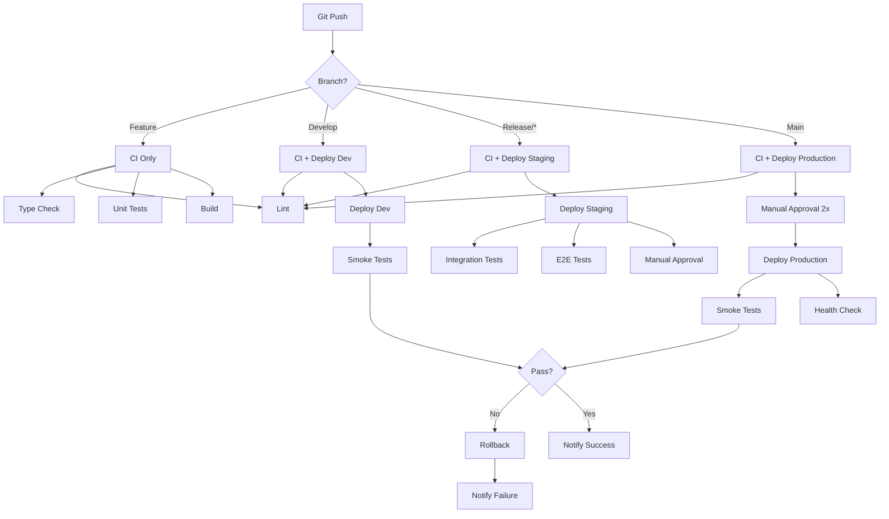

# CI/CD Pipeline Documentation

## Overview

The AI Roadcall Assistant platform uses GitHub Actions for continuous integration and deployment. The pipeline automates testing, building, and deploying infrastructure across multiple environments with built-in safety checks and rollback capabilities.

## Pipeline Architecture



## Workflows

### 1. CI Workflow

**Trigger**: Pull requests and pushes to main/develop

**Jobs**:
- **Lint**: ESLint and Prettier checks
- **Type Check**: TypeScript compilation
- **Unit Tests**: Jest tests with coverage
- **Build**: Build all packages and services

**Configuration**: `.github/workflows/ci.yml`

### 2. Deploy Workflow

**Trigger**: Pushes to main, develop, release/* branches

**Jobs**:
- **Determine Environment**: Maps branch to environment
- **Deploy Dev**: Deploys to development environment
- **Deploy Staging**: Deploys to staging with approval
- **Deploy Production**: Deploys to production with 2x approval
- **Rollback**: Automatic rollback on failure

**Configuration**: `.github/workflows/deploy.yml`

### 3. Notifications Workflow

**Trigger**: Completion of CI or Deploy workflows

**Jobs**:
- **Notify Slack**: Sends status to Slack channel
- **Notify Email**: Sends failure emails to team

**Configuration**: `.github/workflows/notify.yml`

## Environments

### Development (dev)
- **Branch**: `develop`
- **Approval**: None
- **Tests**: Smoke tests
- **Purpose**: Rapid iteration and testing

### Staging
- **Branch**: `release/*`
- **Approval**: 1 reviewer
- **Tests**: Integration + E2E + Smoke
- **Purpose**: Pre-production validation

### Production
- **Branch**: `main`
- **Approval**: 2 reviewers
- **Tests**: Smoke + Health check
- **Purpose**: Live customer-facing environment

## Deployment Process

### Development Deployment

1. Developer pushes to `develop` branch
2. CI workflow runs (lint, test, build)
3. If CI passes, deploy workflow triggers
4. Infrastructure deployed via CDK
5. Smoke tests verify basic functionality
6. Slack notification sent

**Timeline**: ~10-15 minutes

### Staging Deployment

1. Create release branch: `git checkout -b release/v1.0.0`
2. Push to GitHub
3. CI workflow runs
4. Deploy workflow triggers
5. Infrastructure deployed to staging
6. Integration tests run (~5 minutes)
7. E2E tests run (~15 minutes)
8. Manual approval required (1 reviewer)
9. Deployment completes
10. Slack notification sent

**Timeline**: ~30-40 minutes (including approval)

### Production Deployment

1. Merge release branch to `main`
2. CI workflow runs
3. Deploy workflow triggers
4. Manual approval required (2 reviewers)
5. Infrastructure deployed to production
6. Smoke tests run (~2 minutes)
7. Health check verification
8. Slack notification sent

**Timeline**: ~15-20 minutes (including approvals)

## Testing Strategy

### Unit Tests
- **When**: Every PR and push
- **Tool**: Jest
- **Coverage**: 80% minimum
- **Duration**: ~2-3 minutes

### Integration Tests
- **When**: Staging deployments
- **Tool**: Jest with LocalStack
- **Coverage**: Service interactions
- **Duration**: ~5 minutes

### E2E Tests
- **When**: Staging deployments
- **Tool**: Playwright
- **Coverage**: Critical user flows
- **Duration**: ~15 minutes

### Smoke Tests
- **When**: All deployments
- **Tool**: Bash scripts + curl
- **Coverage**: Basic API availability
- **Duration**: ~1-2 minutes

## Rollback Procedures

### Automatic Rollback

Triggered when:
- Smoke tests fail
- Health check fails
- Deployment errors occur

Process:
1. Detect failure
2. Checkout previous commit
3. Redeploy infrastructure
4. Notify team via Slack and email

### Manual Rollback

Via GitHub Actions:
1. Go to Actions → Deploy
2. Click "Run workflow"
3. Select previous commit SHA
4. Approve deployment

Via Git:
```bash
# Revert to previous version
git revert HEAD
git push origin main

# Or reset to specific commit
git reset --hard <commit-sha>
git push --force origin main
```

## Security

### OIDC Authentication
- No AWS credentials stored in GitHub
- Temporary credentials via OIDC
- Role-based access control

### Secrets Management
- GitHub Secrets for sensitive data
- AWS Secrets Manager for application secrets
- Automatic secret rotation

### Approval Gates
- Staging: 1 reviewer required
- Production: 2 reviewers required
- Prevents unauthorized deployments

## Monitoring

### GitHub Actions
- Workflow status in Actions tab
- Detailed logs for each job
- Artifact downloads (test reports, coverage)

### AWS CloudWatch
- Deployment logs
- Application metrics
- Custom dashboards

### Slack Notifications
- Real-time deployment status
- Failure alerts with details
- Links to workflow runs

### Email Notifications
- Failure notifications to team
- Includes error details and logs
- Links to troubleshooting resources

## Performance Optimization

### Caching
- pnpm dependencies cached
- Build artifacts cached
- Reduces build time by ~50%

### Parallel Execution
- Tests run in parallel
- Multiple environments deploy concurrently
- Reduces total pipeline time

### Incremental Builds
- Only changed packages rebuilt
- Turborepo handles dependencies
- Faster iteration cycles

## Troubleshooting

### Common Issues

#### 1. Authentication Failures
**Symptom**: "Could not assume role" error

**Solutions**:
- Verify `AWS_ROLE_ARN` secret
- Check OIDC provider configuration
- Verify trust policy
- Check role permissions

#### 2. Test Failures
**Symptom**: Tests fail in CI but pass locally

**Solutions**:
- Check environment variables
- Verify service availability
- Review test logs
- Run tests with same Node version

#### 3. Deployment Timeouts
**Symptom**: CDK deployment times out

**Solutions**:
- Check AWS service quotas
- Verify resource availability
- Review CloudFormation events
- Increase timeout in workflow

#### 4. Notification Issues
**Symptom**: No Slack/email notifications

**Solutions**:
- Verify webhook URLs
- Check secret names
- Test webhooks manually
- Review workflow logs

### Debug Commands

```bash
# Run CI locally
pnpm lint
pnpm typecheck
pnpm test
pnpm build

# Run E2E tests locally
cd tests/e2e
pnpm install
pnpm test

# Run smoke tests locally
export API_URL=https://api.dev.roadcall.example.com
bash tests/smoke/smoke-tests.sh

# Check CDK diff
cd infrastructure
pnpm cdk diff --all

# Deploy manually
cd infrastructure
pnpm cdk deploy --all --require-approval never
```

## Metrics and KPIs

### Pipeline Metrics
- **Build Success Rate**: Target 95%
- **Average Build Time**: Target <15 minutes
- **Deployment Frequency**: Multiple per day (dev)
- **Mean Time to Recovery**: Target <30 minutes

### Quality Metrics
- **Test Coverage**: Target 80%
- **Test Pass Rate**: Target 98%
- **E2E Test Duration**: Target <20 minutes
- **Flaky Test Rate**: Target <2%

## Best Practices

### 1. Commit Messages
```bash
# Good
git commit -m "feat: add vendor matching algorithm"
git commit -m "fix: resolve payment processing timeout"
git commit -m "test: add E2E tests for tracking flow"

# Avoid
git commit -m "updates"
git commit -m "fix bug"
```

### 2. Branch Naming
```bash
# Features
feature/vendor-matching
feature/payment-processing

# Fixes
fix/auth-timeout
fix/tracking-subscription

# Releases
release/v1.0.0
release/v1.1.0
```

### 3. Pull Requests
- Keep PRs small and focused
- Include tests for new features
- Update documentation
- Request reviews from relevant team members

### 4. Testing
- Write tests before pushing
- Run full test suite locally
- Fix flaky tests immediately
- Maintain test coverage

### 5. Deployments
- Deploy to dev frequently
- Test thoroughly in staging
- Deploy to production during business hours
- Monitor deployments actively

## Maintenance

### Weekly Tasks
- Review failed workflows
- Update dependencies
- Check test coverage
- Review deployment metrics

### Monthly Tasks
- Rotate AWS credentials
- Update GitHub Actions versions
- Review and optimize workflows
- Update documentation

### Quarterly Tasks
- Security audit
- Performance review
- Cost optimization
- Team training

## Resources

- [GitHub Actions Documentation](https://docs.github.com/en/actions)
- [AWS CDK Documentation](https://docs.aws.amazon.com/cdk/)
- [Playwright Documentation](https://playwright.dev/)
- [Turborepo Documentation](https://turbo.build/)

## Support

For issues or questions:
- Create GitHub issue
- Contact DevOps team
- Check troubleshooting guide
- Review workflow logs
