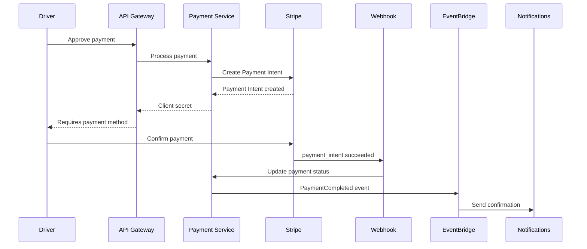
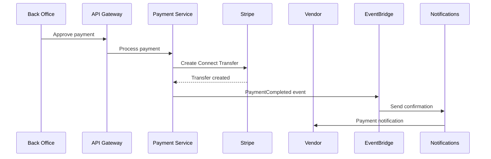

# Stripe Integration for Payment Service

This document describes the Stripe integration implementation for the AI Roadcall Assistant payment service.

## Overview

The payment service integrates with Stripe to process two types of payments:

1. **IC Driver Payments**: Direct payments from independent contractor drivers using Stripe Payment Intents API
2. **Back Office Payments**: Vendor payouts via Stripe Connect transfers

## Features Implemented

### 1. Stripe Client Initialization

- Singleton Stripe client with automatic configuration loading from AWS Secrets Manager
- Support for secret rotation without service restart
- Configurable retry logic with exponential backoff
- Comprehensive error handling and logging

### 2. Payment Intent Operations (IC Driver Payments)

- **Create Payment Intent**: Initialize payment with automatic payment methods
- **Confirm Payment Intent**: Complete payment with optional payment method
- **Retrieve Payment Intent**: Get current payment status
- **Cancel Payment Intent**: Cancel pending payments
- **Idempotency**: Automatic idempotency key generation to prevent duplicate charges

### 3. Stripe Connect Operations (Vendor Payouts)

- **Create Transfer**: Transfer funds to vendor's Stripe Connect account
- **Retrieve Transfer**: Get transfer status
- **Create Payout**: Initiate payout to vendor's bank account
- **Idempotency**: Automatic idempotency key generation for transfers

### 4. Webhook Handler

Secure webhook endpoint with signature verification for handling Stripe events:

- `payment_intent.succeeded` - Payment completed successfully
- `payment_intent.payment_failed` - Payment failed
- `payment_intent.canceled` - Payment canceled
- `payment_intent.requires_action` - Additional authentication required
- `transfer.created` - Transfer initiated
- `transfer.failed` - Transfer failed
- `transfer.reversed` - Transfer reversed
- `payout.paid` - Payout completed
- `payout.failed` - Payout failed

### 5. Automatic Retry with Exponential Backoff

- Configurable retry attempts (default: 3)
- Exponential backoff with jitter (±25%)
- Smart retry logic: no retry on 4xx client errors
- Maximum delay cap to prevent excessive wait times

### 6. Payment Confirmation Notifications

- Automatic notification to vendors when payment is completed
- Multi-channel delivery (push, SMS, email)
- Formatted currency amounts for user-friendly display

## Configuration

### Secrets Manager Setup

Store Stripe credentials in AWS Secrets Manager with the following structure:

```json
{
  "apiKey": "sk_live_...",
  "webhookSecret": "whsec_...",
  "connectEnabled": true
}
```

**Secret Name**: `roadcall/stripe/api-keys` (configurable via `STRIPE_SECRET_NAME` environment variable)

### Environment Variables

- `STRIPE_SECRET_NAME`: Name of the secret in Secrets Manager (default: `roadcall/stripe/api-keys`)
- `TABLE_NAME`: DynamoDB table name for payments
- `DB_SECRET_NAME`: Database credentials secret name

### Automatic Secret Rotation

The service supports automatic secret rotation:

1. Update the secret in AWS Secrets Manager
2. Call the `reloadStripeConfig()` function or restart the Lambda function
3. New requests will use the updated credentials

## API Endpoints

### Process Payment

**Endpoint**: `POST /payments/{id}/process`

**Description**: Process an approved payment via Stripe

**Request Body**:
```json
{
  "vendorStripeAccountId": "acct_..." // Required for back_office payments
}
```

**Response**:
```json
{
  "payment": { /* Payment object */ },
  "stripePaymentIntentId": "pi_...",
  "stripeTransferId": "tr_...",
  "requiresAction": false,
  "clientSecret": "pi_..._secret_..."
}
```

### Stripe Webhook

**Endpoint**: `POST /payments/webhooks/stripe`

**Description**: Receive and process Stripe webhook events

**Headers**:
- `Stripe-Signature`: Webhook signature for verification

**Request Body**: Raw Stripe event JSON

**Response**:
```json
{
  "received": true,
  "eventId": "evt_..."
}
```

## Payment Flow

### IC Driver Payment Flow



### Back Office Payment Flow



## Error Handling

### Retry Logic

The service implements automatic retry with exponential backoff for transient errors:

- **Initial delay**: 1000ms
- **Backoff multiplier**: 2x
- **Max delay**: 10000ms
- **Max retries**: 3
- **Jitter**: ±25%

### Error Types

1. **Client Errors (4xx)**: No retry, immediate failure
2. **Server Errors (5xx)**: Automatic retry with backoff
3. **Network Errors**: Automatic retry with backoff
4. **Timeout Errors**: Automatic retry with backoff

### Webhook Failures

- Stripe automatically retries failed webhooks
- Failed webhooks are logged for manual review
- DLQ (Dead Letter Queue) captures unprocessable events

## Security

### Webhook Signature Verification

All webhook requests are verified using Stripe's signature verification:

```typescript
const event = stripe.webhooks.constructEvent(
  rawBody,
  signature,
  webhookSecret
);
```

### Idempotency

All payment operations use idempotency keys to prevent duplicate charges:

- Payment Intents: `payment_{paymentId}`
- Transfers: `transfer_{paymentId}`

### Secrets Management

- API keys stored in AWS Secrets Manager
- Automatic rotation support
- No hardcoded credentials
- Secrets never logged or exposed in errors

## Monitoring and Logging

### CloudWatch Logs

All operations are logged with structured JSON:

```json
{
  "level": "info",
  "message": "Payment Intent created",
  "paymentIntentId": "pi_...",
  "paymentId": "uuid",
  "amountCents": 15000
}
```

### CloudWatch Metrics

Custom metrics published for:

- Payment success rate
- Payment processing time
- Webhook processing time
- Retry attempts
- Failed payments

### X-Ray Tracing

All Stripe API calls are traced with AWS X-Ray for performance monitoring.

## Testing

### Unit Tests

Test coverage for:

- Payment Intent creation
- Transfer creation
- Webhook signature verification
- Retry logic
- Error handling

### Integration Tests

Test with Stripe test mode:

- Complete payment flow
- Webhook event handling
- Refund processing
- Error scenarios

### Test Cards

Use Stripe test cards for testing:

- Success: `4242 4242 4242 4242`
- Decline: `4000 0000 0000 0002`
- Requires authentication: `4000 0025 0000 3155`

## Stripe Connect Setup

### Vendor Onboarding

1. Create Stripe Connect account for vendor
2. Complete KYC verification
3. Store `stripeAccountId` in vendor profile
4. Enable transfers to vendor account

### Payout Schedule

- Automatic payouts: Daily
- Manual payouts: On-demand via API
- Minimum payout: $10.00

## Compliance

### PCI Compliance

- No card data stored in application
- All card processing via Stripe
- PCI DSS Level 1 compliant

### Financial Regulations

- Transaction records retained for 7 years
- Audit logs for all payment operations
- Fraud detection integration

## Troubleshooting

### Common Issues

1. **Webhook signature verification failed**
   - Verify webhook secret is correct
   - Check raw body is passed to verification
   - Ensure no body parsing before verification

2. **Payment Intent creation failed**
   - Check Stripe API key is valid
   - Verify amount is positive integer
   - Check currency is supported

3. **Transfer failed**
   - Verify vendor Stripe account is active
   - Check vendor has completed KYC
   - Ensure sufficient balance

### Debug Mode

Enable debug logging:

```typescript
process.env.LOG_LEVEL = 'debug';
```

## References

- [Stripe API Documentation](https://stripe.com/docs/api)
- [Stripe Connect Documentation](https://stripe.com/docs/connect)
- [Stripe Webhooks Guide](https://stripe.com/docs/webhooks)
- [Payment Intents API](https://stripe.com/docs/payments/payment-intents)
